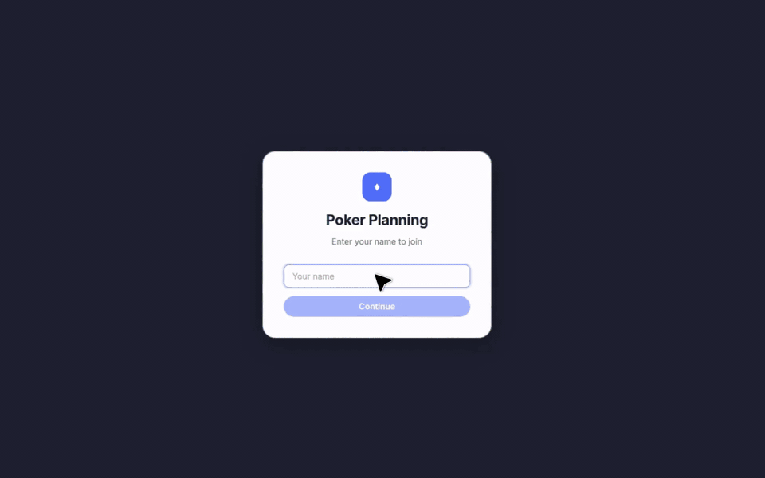

# Pointdeck

## Create a room and invite your team to start estimating

Pointdeck is a browser-friendly planning poker tool designed to make estimation sessions simple and efficient. It can also be embedded into tools like Notion, making it easy to integrate into your existing workflow.

Perfect for agile teams looking to streamline their sprint planning sessions.

You can use it in https://pointdeck.app

## Demo

[Watch the MP4 demo video](./docs/assets/pointdeck_app_demo.mp4)

## Use and Contribution

Feel free to use it and to contribute with the project.
